# Dedup Engine — Architecture Diagram

```mermaid
%%{init: {"theme": "base", "layout": "elk", "flowchart": {"curve": "step"}}}%%
graph LR

  subgraph Input["Alert Input"]
    STIX["STIX 2.1 Bundle"]:::teal
  end

  subgraph Parsing["Extraction"]
    PARSER["STIX Parser"]:::sky
    NF["Notable Fields\nFallback"]:::sky
  end

  subgraph Normalization["Normalization"]
    NORM["IOC Normalizer"]:::sky
  end

  subgraph Fingerprinting["Fingerprinting"]
    TB["Time Bucket\nCompute"]:::yellow
    HASH["SHA-256\nPer Slot"]:::yellow
    ARR["Slot Array\nip | user | email | domain\nurl | file_hash\nalert_name | time_bucket"]:::yellow
  end

  subgraph Validation["Input Validation"]
    VAL{"Zero IOCs?"}:::rose
    DQ["Log Data\nQuality Issue"]:::slate
  end

  subgraph Layer1["Layer 1 — Hash Dedup"]
    L1_PRE["Stage 1: SINTER\nalert_name + time_bucket"]:::violet
    L1_IOC["Stage 2: Count\nIOC Slot Matches"]:::violet
    L1_CONF["Hash Confidence\nmatched / total"]:::fuchsia
    L1_THR{"Above\nL1 Threshold?\n(conf >= 0.80)"}:::rose
  end

  subgraph Layer2["Layer 2 — Fuzzy Matching"]
    L2_BUCKET["Same time_bucket\nDIFFERENT alert_name"]:::orange
    L2_FUZZY["Token Sort Ratio\nPer IOC Type\n(ip | user | email\ndomain | url | file_hash)"]:::orange
    L2_SCORE["Fuzzy Score\nmean(per_type_scores)"]:::fuchsia
    L2_THR{"Above\nL2 Threshold?\n(fuzzy >= 80)"}:::rose
  end

  subgraph CrossVal["STIX Cross-Validation (threshold >= 80)"]
    SOBJ["STIX Object\nSimilarity\n(indicator, identity,\nattack-pattern)"]:::violet
    SOBS_T["Observable\nby Type\n(set intersection\nper IOC type)"]:::violet
    SOBS_V["Observable\nby Value\n(value-level\nintersection)"]:::violet
  end

  subgraph Result["Result"]
    DUP["DUPLICATE\nLayer 1"]:::green
    SIM["SIMILAR\nLayer 2"]:::yellow
    NEW["NEW"]:::lime
  end

  subgraph Storage["Redis"]
    RD_FWD[("Forward Index\nalert_id → hashes")]:::green
    RD_INV[("Inverted Index\nslot:hash → alert_ids")]:::green
    RD_BND[("Bundle Store\nbundle + IOCs + rule")]:::green
    RD_RES[("Result Cache")]:::green
  end

  subgraph Logging["Audit Log"]
    LOG["logs/dedup.jsonl"]:::slate
  end

  %% === Input to Parsing ===
  STIX --> PARSER
  STIX --> NF

  %% === Parsing to Normalization ===
  PARSER --> NORM
  NF --> NORM

  %% === Normalization to Fingerprinting ===
  NORM --> TB
  NORM --> HASH
  TB --> ARR
  HASH --> ARR

  %% === Fingerprinting to Validation ===
  ARR --> VAL

  %% === Validation branching ===
  VAL -->|"Yes"| DQ
  DQ --> NEW
  VAL -->|"No"| L1_PRE

  %% === Layer 1 flow ===
  L1_PRE --> L1_IOC
  L1_IOC --> L1_CONF
  L1_CONF --> L1_THR

  %% === Layer 1 branching ===
  L1_THR -->|"Yes"| SOBJ
  L1_THR -->|"No"| L2_BUCKET

  %% === Layer 2 flow ===
  L2_BUCKET --> L2_FUZZY
  L2_FUZZY --> L2_SCORE
  L2_SCORE --> L2_THR

  %% === Layer 2 branching ===
  L2_THR -->|"Yes"| SOBJ
  L2_THR -->|"No"| NEW

  %% === Cross-validation flow ===
  SOBJ --> SOBS_T
  SOBS_T --> SOBS_V
  SOBS_V --> DUP
  SOBS_V --> SIM

  %% === Storage connections ===
  ARR --> RD_FWD
  ARR --> RD_INV
  ARR --> RD_BND
  DUP --> RD_RES
  SIM --> RD_RES
  NEW --> RD_RES
  L1_PRE --> RD_INV
  L1_IOC --> RD_INV
  L2_BUCKET --> RD_INV
  SOBJ --> RD_BND
  SOBS_T --> RD_BND

  %% === Logging ===
  DUP --> LOG
  SIM --> LOG
  NEW --> LOG
  DQ --> LOG

  classDef teal stroke:#2dd4bf,fill:#f0fdfa;
  classDef orange stroke:#fb923c,fill:#fff7ed;
  classDef sky stroke:#38bdf8,fill:#f0f9ff;
  classDef violet stroke:#a78bfa,fill:#f5f3ff;
  classDef fuchsia stroke:#e879f9,fill:#fdf4ff;
  classDef cyan stroke:#22d3ee,fill:#ecfeff;
  classDef green stroke:#4ade80,fill:#f0fdf4;
  classDef lime stroke:#a3e635,fill:#f7fee7;
  classDef rose stroke:#fb7185,fill:#fff1f2;
  classDef yellow stroke:#facc15,fill:#fefce8;
  classDef slate stroke:#94a3b8,fill:#f8fafc;
```



## Layer Summary

| Layer | Purpose | Color | Components |
|-------|---------|-------|------------|
| Alert Input | Incoming STIX bundle | teal | 1 |
| Extraction | Parse STIX objects + notable fields fallback | sky | 2 |
| Normalization | Lowercase, normalize IPs, strip CIDR | sky | 1 |
| Fingerprinting | Compute time bucket, hash each slot, build array | yellow | 3 |
| Input Validation | Reject alerts with zero IOCs | rose/slate | 2 |
| Layer 1 — Hash Dedup | Same rule: SINTER prerequisites, count IOC matches, hash confidence | violet/fuchsia/rose | 4 |
| Layer 2 — Fuzzy Matching | Different rule: same time bucket, Token Sort Ratio on IOC values | orange/fuchsia/rose | 4 |
| STIX Cross-Validation | STIX Object + Observable (by type + by value) for DUPLICATE and SIMILAR | violet | 3 |
| Result | DUPLICATE (L1), SIMILAR (L2), or NEW | green/yellow/lime | 3 |
| Redis | Forward index, inverted index, bundle store, result cache | green | 4 |
| Audit Log | Structured JSONL with all scores and full input data | slate | 1 |

## Flow Summary

```
STIX Bundle → Parse → Normalize → Fingerprint → Validate
                                                    │
                                              Zero IOCs? → Yes → NEW (data quality)
                                                    │ No
                                                    ▼
                                              Layer 1: Hash Dedup
                                              (same rule + same time bucket)
                                                    │
                                              Above L1 threshold? → Yes → Cross-Validate → DUPLICATE
                                                    │ No
                                                    ▼
                                              Layer 2: Fuzzy Matching
                                              (different rule + same time bucket)
                                                    │
                                              Above L2 threshold? → Yes → Cross-Validate → SIMILAR
                                                    │ No
                                                    ▼
                                                   NEW
```

## Thresholds (config.yaml)

| Threshold | Value | Used By |
|-----------|-------|---------|
| Layer 1 confidence | 0.80 | Hash confidence = matched_slots / total_slots |
| Layer 2 similarity | 80 | Mean of per-type fuzzy scores (Token Sort Ratio) |
| STIX equivalence | 80 | STIX Object similarity (indicator, identity, attack-pattern) |
| Dedup window | 30 min | Time bucket for both Layer 1 and Layer 2 |

## Architectural Notes

- **Two layers, no overlap**: Layer 1 handles same-rule alerts, Layer 2 handles cross-rule alerts. Different `alert_name` is required for Layer 2 candidates.
- **Layer 2 fuzzy slots are IOC-only**: The 6 IOC types (ip, user, email, domain, url, file_hash) are compared via Token Sort Ratio. `alert_name` is not in the fuzzy comparison — it's only used as a filter (skip same rule) and as a prerequisite hash in Layer 1.
- **Fuzzy score = mean of per-type scores**: `mean(per_type_scores)` across IOC types present in either alert. Types missing from one side score 0; types missing from both are excluded.
- **Inverted index**: Same pattern as Elasticsearch/Lucene — index by value, lookup by content. Used by both layers.
- **Cross-validation runs for both verdicts**: DUPLICATE and SIMILAR both get STIX Object + Observable scores.
- **Five scores per match**: Hash confidence (L1), Fuzzy score (L2), STIX Object, Observable/Type, Observable/Value.
- **Observable gap closed**: STIX Observable uses parsed IOC data (same as hash), not raw STIX objects — no blind spots from vendor notable fields.
- **Two observable perspectives**: Obs/Type (which IOC types matched) and Obs/Value (actual value-level intersection across all types).
- **Three verdicts**: DUPLICATE (exact, same rule), SIMILAR (fuzzy, different rule), NEW (no match).
- **Logging is unconditional**: Every alert logged with all scores, input data, candidates, and time bucket info.
- **Config is volume-mounted**: `config.yaml` is mounted into the container via docker-compose, so threshold changes take effect on restart without rebuilding the image.
