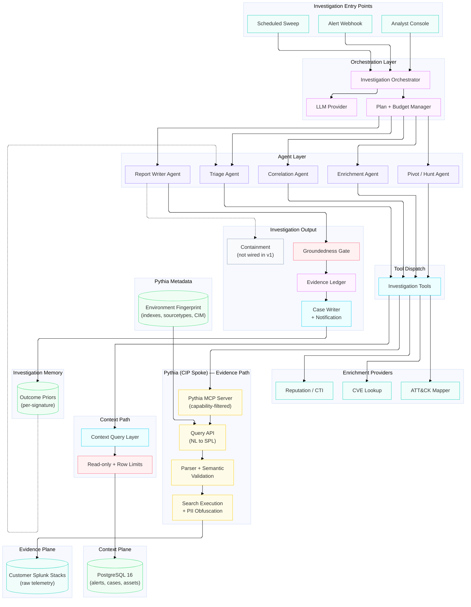

# AI SOC Agents Architecture Diagram

**Last Updated:** 2026-09-17
**Diagram Type:** Architecture Diagram
**Owner:** CIP AI/ML Architecture

---

## Diagram

---

## Layer Summary

| Layer | Purpose | Primary Color | Component Count |
|-------|---------|---------------|-----------------|
| Investigation Entry Points | Analyst-initiated, event-driven, and scheduled triggers | teal | 3 |
| Orchestration Layer | Investigation planning, query budget allocation, model brokering | fuchsia | 3 |
| Agent Layer | Narrow specialists (triage, enrichment, pivot, correlation, writer) | violet | 5 |
| Tool Dispatch | Single hub routing agent tool calls to evidence, context, and enrichment | cyan | 1 |
| Enrichment Providers | CVE, MITRE ATT&CK, and reputation/CTI lookups | teal | 3 |
| Investigation Output | Groundedness gate, evidence ledger, case creation, notification, containment (unwired) | rose / fuchsia / cyan / slate | 4 |
| Pythia (CIP Spoke) | NL to SPL generation, validation, obfuscation, execution against customer Splunk | yellow | 4 |
| Pythia Metadata | Live per-tenant Splunk fingerprint used to ground generated SPL | green | 1 |
| Context Path | SQL access to first-party investigation context | cyan / rose | 2 |
| Investigation Memory | Per-signature outcome priors that suppress repeat alerts | green | 1 |
| Context Plane | Alerts (dedup_v2), cases, assets, detections, CTI, evidence | green | 1 |
| Evidence Plane | Raw security telemetry across customer Splunk stacks | teal | 1 |

**Total: 29 components across 12 layers.**

---

## Architectural Notes

**Architectural style:** Agent-tiered, two-plane investigation architecture. An orchestrator plans an investigation and dispatches it to narrow specialist agents, which reach data through a single tool-dispatch hub. The two planes are reached by different means: **evidence** through Pythia — natural language to SPL, grounded in a live per-tenant Splunk fingerprint — and **context** through direct SQL against first-party PostgreSQL. Cross-source correlation happens in the orchestrator rather than in a query engine, which keeps each plane accessed in its own native language instead of forcing both into one.

**Why the evidence path runs through Pythia:** Splunk is schema-on-read, so the quality of a generated search depends almost entirely on knowing what actually exists in a given tenant. Pythia continuously probes each customer stack — indexes, sourcetypes, fields, CIM mappings — and uses that live fingerprint as query-time context, so generated SPL references real fields and real indexes. It then validates with the Splunk parser plus a semantic dry-run, scores confidence, and obfuscates PII before any prompt reaches a model. None of that is reproducible by pointing a generic query layer at Splunk.

**Guardrail ownership:** Evidence-path guardrails are **internal to Pythia** — capability-filtered tools, per-service-principal rate limits, parser and semantic validators, customer consent gates, and the obfuscation pipeline. We own the context-path guardrails (`Read-only + Row Limits`) and the orchestrator's query budget. This is a deliberate trade: less code to write and a mature pipeline for free, against less direct control and a cross-team dependency on limits we do not set.

**Verdict honesty is enforced mechanically:** every Report Writer output passes a `Groundedness Gate` before it can become a verdict. Concrete indicators asserted in the output (IPs, hashes, CVEs, ATT&CK technique IDs, domains) are extracted by regex and checked against the evidence actually cited in the ledger; anything claimed but not present is a hallucination and routes the case to manual review. This is deterministic and needs no model in the loop, so it can gate CI as well as runtime. The investigation report schema also carries an explicit `unknowns` list, so the agent must state what it could not establish rather than silently omitting it.

**The closed loop has safety rules, not just a feedback arrow:** dispositions write back as per-signature `Outcome Priors` so a later alert with the same evidence signature is suppressed rather than re-triaged. Four rules govern it: human-authored priors suppress immediately while AI-authored priors require corroboration across repeat outcomes at high confidence; only auto-closeable dispositions (false positive, benign) ever suppress; **a prior true-positive never auto-closes a future alert**; and human authorship is sticky, so an AI prior a human overrode never downgrades. Rule three is the difference between shrinking noise and suppressing a real incident.

**Key trust boundaries:**
- Entry Points to Orchestration: alert payloads and analyst free text are both untrusted input to query construction
- Tool Dispatch to Pythia: authentication is a Pythia service principal whose `rate_per_hour` is the hard ceiling on agent search throughput
- Pythia to LLM: PII obfuscation runs before any prompt leaves, so raw customer telemetry never reaches a model
- Context Path to Context Plane: read-only credentials and enforced row limits, applied in code rather than in prompts
- Pythia to Customer Splunk: per-tenant `stack_id` scoping and customer consent gates, enforced by Pythia rather than by us

**External dependencies:**
- **Pythia:** CIP spoke owned by another team. Provides the entire evidence path. Agent-driven load and any new tools are a cross-team dependency
- **PostgreSQL:** first-party store for alerts (`dedup_v2` output), cases, assets, detections, CTI, and the evidence ledger
- **Customer Splunk stacks:** reached only through Pythia, never directly
- **LLM Provider:** used by our agents for reasoning; Pythia separately calls its own model inside the SPL pipeline

**Dashed connections (`-.->`) explained:**
- `WRT -.-> CONT` — containment is deliberately unwired in v1; the agent recommends, a human executes
- `OUTC -.-> TRI` — the feedback path. Outcome priors inform triage on the next alert carrying the same evidence signature, which is what makes alert volume shrink over time rather than merely being processed faster

**Known gaps:**
- **Rate limit as the real ceiling.** A Pythia principal's `rate_per_hour` caps how many customer-Splunk searches an agent can run, and an investigation agent is far burstier than a human analyst. Sizing this is a prerequisite, not a tuning task
- **Throughput headroom.** Pythia's production architecture notes record a CIP service principal's automated cron driving load 22 on 8 vCPUs and returning 504s on a single EC2 host. Confirm the production transpose landed before pointing agents at it
- **Tenancy fit.** Pythia is built around MDR `stack_id` per customer; confirm it serves a single-tenant internal SOC without contortion
- **Context-plane natural language to SQL is unsolved.** Pythia covers telemetry only. The context path currently assumes hand-written parameterised queries; an NL layer over the PostgreSQL schema is a separate decision
