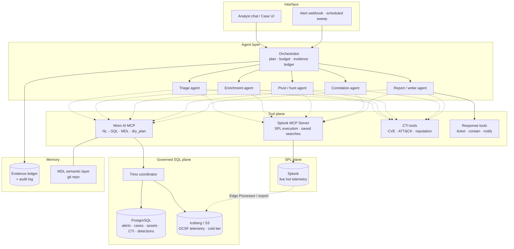

# AI SOC Agents — Architecture Research & Proposal

**Status:** Draft for brainstorming · **Date:** 2026-09-16
**Scope:** Agentic investigation of security alerts over PostgreSQL + Splunk, using Trino and Wren AI.

---

## 1. Executive summary

The intended shape — *"one SQL plane over Postgres + Splunk via Trino, with Wren AI doing NL→SQL"* — is **half achievable today**.

| Leg | Verdict |
|---|---|
| Trino → PostgreSQL | ✅ First-class, open source, mature |
| Wren AI → Trino | ✅ Supported first-class connector (via Ibis) |
| Wren AI → PostgreSQL (direct) | ✅ Supported |
| **Trino → Splunk** | ⚠️ **No open-source connector exists.** Only Starburst Enterprise (commercial), and it can query **saved reports only** — not arbitrary SPL or indexes |

**Consequence:** Splunk cannot be a general-purpose Trino catalog without either (a) a paid Starburst license *and* accepting a saved-report-only surface, or (b) landing Splunk data in an open table format, or (c) treating Splunk as a **second, non-SQL query plane**.

**Recommendation (revised 2026-09-16):** **build a native open-source Trino Splunk connector** — see [`splunk-connector-design.md`](./splunk-connector-design.md). Splunk's REST API fully supports it; Starburst's limits are product choices, not Splunk constraints. This collapses the architecture to a **single SQL plane**, with real cross-source joins between Postgres alert context and Splunk telemetry.

Until the connector reaches M5 (~2 months), use the **official Splunk MCP Server** as a second plane so agent development is not blocked. The two-plane design below remains the accurate description of the interim state, and the MCP server stays useful afterwards as an SPL escape hatch.

---

## 2. Research findings

### 2.1 Trino

- Open-source distributed SQL query engine; connectors are catalogs configured per data source.
- **Ships with:** PostgreSQL, Elasticsearch, OpenSearch, Kafka, Iceberg, Delta Lake, Hive, MongoDB, Redis, Prometheus, MySQL, SQL Server, and ~40 more.
- **Does NOT ship with:** Splunk. Confirmed against the Trino 483 connector index.
- Federation model: one ANSI SQL dialect, cross-catalog joins, pushdown where the connector supports it.

### 2.2 Starburst Splunk connector (the only Trino↔Splunk path)

Verified against Starburst Enterprise docs:

- Requires **a valid Starburst Enterprise license** — commercial, not OSS.
- Connects to Splunk management port **8089** over HTTPS with username/password.
- **Read-only, and only via previously saved searches/reports.** No ad-hoc SPL, no direct index access.
- Report descriptions must be empty or schema parsing errors occur.
- Type map is narrow: `BOOLEAN, INTEGER, BIGINT, DOUBLE, VARCHAR, DATE, TIME(3), TIMESTAMP(3)`. Everything else unsupported.
- **Predicate pushdown is disabled by default** due to NULL-handling correctness issues → naive queries can drag full report result sets across the wire.
- Dynamic filtering on by default; table scan redirection / cached views supported.

**SOC implication:** this is not "SQL over Splunk." It is "SQL over a fixed menu of pre-approved searches." That is *not fatal* — a curated set of investigation views (auth events, proxy, DNS, EDR process tree, VPN) as saved reports is a legitimate governance model — but it kills open-ended hunting through Trino, and pushdown limits make it slow for high-cardinality telemetry.

### 2.3 Wren AI — and an important version discontinuity

Wren AI (Canner/WrenAI, **Apache 2.0**) went through a significant architectural change in 2026. **Two different products share the name**, and the docs site and GitHub currently describe different things:

**"Classic" / v1 (archived):** three Docker services — Wren UI (`:3000`), Wren AI Service (retrieval, prompting, SQL gen, validation), Wren Engine/Core (metadata, SQL translation). Chat-first BI app. Now on branch `legacy/v1`, tag `v1-final`, **no ongoing maintenance**.

**Current main (post 2026-05-07):** `wren-engine` merged into the repo under `core/`. Now an **agent-native library/CLI**, not a chat app:

```
core/wren-core/        Rust semantic engine on Apache DataFusion
core/wren-core-base/   shared manifest types
core/wren-core-py/     Python bindings
core/wren-core-wasm/   browser/WASM build
core/wren/             Python SDK + `wren` CLI
sdk/wren-langchain/    LangChain / LangGraph integration
sdk/wren-pydantic/     Pydantic AI integration
skills/                agent context-authoring workflows
```

- Install: `pip install "wrenai[trino,postgres,memory]"` — connector extras include **trino**, postgres, mysql, bigquery, snowflake, clickhouse, sqlserver, databricks, redshift, spark, athena, oracle; plus `memory` (LanceDB schema/query memory), `ui`, `all`.
- Uses **Ibis** under the hood for connections (the Trino/Starburst connect flow explicitly maps Ibis credentials).
- Trino connection config: host, port, **schemas as `catalogA.schemaA, catalogB.schemaB`**, username, password, SSL (SSL is **mandatory** with user/password auth).
- **MDL (Modeling Definition Language)** — the semantic/context layer: models, columns, relationships, cubes, metrics, enums, units, approved joins, plus unstructured `instructions.md` and `queries.yml`. Stored as **git-versioned YAML/Markdown in a repo you own**.
- **MCP server included in OSS.** Tool surface observed: `run_sql`, `dry_run`, `dry_plan`, `query_cube`, `get_mdl`, `list_models`, `describe_model`, `describe_schema`, `get_data_source`, `list_cubes`, `describe_cube`, `list_functions`, `get_instructions`, `recall_queries`, `get_context`, `list_stored_queries`, `list_knowledge`.
- CLI: `wren query --sql '...'`, `wren ask "<question>" --guided|--direct`, `wren skills get onboarding|enrich-context|genbi`, `wren cloud create/link`.
- Guardrails built in: **dry-plan validation, row limits, structured error handling**.
- **Commercial only (not OSS):** row/column-level security, GenBI UI, embedded dashboards, scenario harnesses, advanced audit.

> ⚠️ **Verify before building.** `docs.getwren.ai/oss/installation` still documents the Docker launcher + `localhost:3000` three-service shape, while GitHub `main` documents the pip/CLI/MCP shape. Pin a version and confirm which one you are actually deploying before committing the design. This is the single biggest unknown in this document.

**Why the new shape is better for us:** MDL-as-git-files means the investigation ontology is code-reviewed, diffable, and CI-testable — which matters far more for a SOC than a chat UI. And an MCP server means our agents consume Wren as a *tool*, not as an app.

### 2.4 Splunk's own agentic surface

- **MCP Server for Splunk platform reached GA in Feb 2026**, distributed as a Splunkbase app (v1.x). Legacy cloud-hosted variants deprecated.
- Exposes three capability families: knowledge-object exploration (saved searches, lookups), **SPL search execution**, and — if Splunk AI Assistant is installed — `saia_generate_spl`, `saia_explain_spl`, `saia_ask_splunk_question`. Standard tools prefixed `splunk_`.
- Built-in **authn/authz with RBAC** and public-key-encrypted tokens that cannot be reused outside the MCP context.
- Splunk AI Assistant 1.5 adds real-time natural-language SPL editing.
- **SPL2 blends SPL and SQL syntax**, and Federated Search can query external S3/Snowflake/Iceberg/Delta datasets — relevant as an alternative federation direction (Splunk reaching out, rather than Trino reaching in).

**This is the cleanest Splunk path.** Native SPL, no license gymnastics, RBAC that maps to existing Splunk roles, and it is designed for exactly our consumer (an agent).

### 2.5 Industry pattern check (2026)

- Security data lakehouse on **Iceberg + OCSF-normalized Parquet in object storage** is the converged reference architecture; Trino/Athena serve ad-hoc and cold-tier queries.
- Iceberg schema evolution pairs well with OCSF — add/rename fields without rewrites.
- Production AI SOCs are converging on **many narrow, source-specific triage agents** plus shared enrichment agents (e.g. one threat-intel/IOC agent), rather than one monolithic investigator.
- **Self-correcting agents** materially move triage accuracy (reported ~60% → ~92% in one published Elastic Security Labs study) — the loop, not the prompt, is where the accuracy lives.
- The winning pattern closes the loop: **triage outcomes feed back into detection logic**, so alert volume shrinks rather than merely getting processed faster.

---

## 3. Proposed architecture

### 3.1 The core decision: federate at the agent layer, not the storage layer

Forcing Splunk into Trino costs a commercial license and reduces Splunk to saved reports. Instead, give the orchestrator **two query tools** and make the *semantic model* the thing that is shared.



### 3.2 Data placement

| Data | Home | Reached via |
|---|---|---|
| Alerts (incl. `dedup_v2` STIX output), cases, verdicts | PostgreSQL | Trino → Wren |
| Asset inventory, identity, ownership, criticality | PostgreSQL | Trino → Wren |
| Detection metadata, ATT&CK mappings, CVE/CTI catalogs | PostgreSQL | Trino → Wren |
| Live/hot raw telemetry (last 7–30d) | Splunk | Splunk MCP (SPL) |
| Warm/cold normalized telemetry (OCSF Parquet) | Iceberg on S3 | Trino → Wren |
| Investigation transcripts, evidence, outcomes | PostgreSQL | Trino → Wren |

The key move: **Postgres is the context/state plane, Splunk is the evidence plane.** Most investigation reasoning — "is this asset critical, has this alert fired before, is this detection noisy, what did we conclude last time" — is *structured context*, and it all lives in Postgres where Trino + Wren shine. Splunk is hit only when the agent needs raw events.

### 3.3 Wren AI's role — the investigation ontology

Model MDL not as a BI schema but as a **SOC entity ontology**, so the agent inherits analyst vocabulary:

- **Entities:** `alert`, `case`, `asset`, `identity`, `ip`, `domain`, `file_hash`, `process`, `detection`, `technique`.
- **Approved joins:** `alert.asset_id → asset.id`, `alert.detection_id → detection.id`, `detection.technique_id → attack_technique.id`. This is exactly the class of thing an LLM gets subtly wrong — pin it once in MDL, never re-litigate it per prompt.
- **Metrics/cubes:** `alerts_per_detection_per_day`, `fp_rate_by_detection`, `unique_assets_touched`, `first_seen/last_seen` per indicator.
- **Enums & units:** severity scales, verdict values, timestamps normalized to UTC, `asset.criticality`.
- **`instructions.md`:** the tribal knowledge — "service accounts matching `svc_*` legitimately authenticate from the batch subnet"; "detection D-114 is known-noisy on Tuesdays during patching."
- **`queries.yml`:** worked golden examples — the highest-leverage accuracy lever in text-to-SQL.

Because MDL is git-versioned YAML, this becomes a **reviewable artifact with CI**: a test suite of question→expected-SQL pairs that gates every ontology change. That is how you keep the accuracy honest over time.

### 3.4 Agent roles

| Agent | Job | Primary tools |
|---|---|---|
| **Orchestrator** | Decompose alert into an investigation plan, allocate a query/token budget, maintain the evidence ledger, decide when to stop | — |
| **Triage** | Dedup against prior alerts, check detection reliability history, score priority | Wren (Postgres) |
| **Enrichment** | Asset criticality, owner, identity context, CVE/ATT&CK/reputation | Wren + CTI tools |
| **Pivot/Hunt** | Fetch raw evidence, expand blast radius across host/user/IP/time | Splunk MCP (SPL), Wren (Iceberg) |
| **Correlation** | Stitch findings into a timeline; map to ATT&CK chain | Wren |
| **Writer** | Verdict + confidence + cited evidence + recommended action | — |

Keep each agent narrow and source-specific — matching the 2026 production pattern — rather than one general investigator.

### 3.5 Guardrails (non-negotiable for a SOC)

1. **Every generated SQL passes `dry_plan`/`dry_run` before execution.** Wren gives this natively; use it, never bypass.
2. **Read-only credentials, always**, on both Trino and Splunk. Separate Trino catalog roles per agent role.
3. **Mandatory time bounds and row limits.** An agent-generated unbounded scan against Splunk or a lake table is a self-inflicted outage. Enforce in the tool wrapper, not in the prompt.
4. **Query budget per investigation.** Hard cap on count and bytes scanned; orchestrator must degrade gracefully when it hits the cap.
5. **Evidence ledger.** Every claim in the final report cites the query that produced it. No citation → the claim does not ship. (Directly serves the accuracy bar.)
6. **Full audit trail** of NL question → generated SQL/SPL → rows returned → conclusion drawn. This is also the training data for improving the ontology.
7. **No autonomous containment** in v1. Agent recommends; human executes.
8. **SSL mandatory** on the Wren→Trino connection when using password auth.

### 3.6 Self-correction loop

The published accuracy gains come from the loop, not the model. Build in:
- Agent critiques its own verdict against the evidence ledger before emitting.
- Contradictory evidence forces a re-plan rather than a hedged answer.
- Analyst disposition (confirm/overturn) written back to Postgres → feeds `queries.yml` golden examples **and** detection tuning.

---

## 4. Splunk integration — four options

| | **A. Starburst** | **B. Splunk MCP** | **C. Export to Iceberg** | **D. Build connector** ✅ |
|---|---|---|---|---|
| Cost | Starburst license | Included w/ Splunk (verify) | Storage + pipeline eng. | ~3–4 months eng. + maintenance |
| Query surface | Saved reports only | Full SPL | Full SQL | **SQL + full SPL via PTF** |
| In Trino? | Yes | No — separate plane | Yes | **Yes** |
| Cross-source SQL joins | Limited | ❌ In agent code | ✅ | ✅ |
| Type fidelity | 8 types only | Native | Full | **Typed from CIM data models** |
| Parallelism | Single fetch | N/A | Full | **Time-sliced splits** |
| Hunting freedom | ❌ Very constrained | ✅ Full | ✅ Full | ✅ Full |
| Build effort | Low | Low | High | High |

**Recommended: D, with B running in parallel as the interim and long-term fallback.**

Option D is the subject of [`splunk-connector-design.md`](./splunk-connector-design.md). Headline design points:

- Four schemas — `datamodel.*` (CIM, typed, `tstats`-accelerated), `index.*` (generic fallback), `savedsearch.*` (Starburst parity), and `system.query()` (raw SPL passthrough via a Trino polymorphic table function).
- Aggregation pushdown to `tstats` is the core performance win for SOC workloads, which are overwhelmingly count/group-by.
- Parallelism via time-sliced concurrent export jobs — **capped by a semaphore**, because uncapped fan-out will exhaust `srchJobsQuota` and degrade the search head for live analysts.

**A is a trap** unless Starburst is already licensed: you'd pay for a strictly *less* capable Splunk surface than the free MCP server.

**C drops in priority.** The connector delivers cross-source SQL without an ETL pipeline, so Iceberg becomes a Splunk-license *cost* play rather than an architectural prerequisite.

Also worth a one-hour spike: **Splunk Federated Search** queries Iceberg/S3 from inside Splunk — federation pointing the other way.

## 5. Phased plan

**Phase 0 — Spikes (1–2 weeks).** Pin the Wren AI version and resolve the docs/GitHub discrepancy (§2.3). Stand up Trino + Postgres catalog. `pip install "wrenai[trino,postgres]"`, hand-author a minimal MDL over alerts/assets/detections, run `wren ask` on 20 real analyst questions, measure exact-match and semantic-match SQL accuracy. Separately: install the Splunk MCP Server app and confirm licensing, RBAC mapping, and result-size behavior.

**Phase 1 — Single-agent read-only triage.** One alert type. Orchestrator + triage + writer only. Wren over Postgres, Splunk MCP for one fixed evidence query. Output = a draft verdict a human reviews. Success metric: agreement rate with analyst disposition.

**Phase 2 — Multi-agent investigation.** Add enrichment, pivot, correlation. Evidence ledger + citation enforcement. Query budgets. MDL CI test suite gating ontology changes.

**Phase 3 — Splunk connector.** Runs *in parallel* with Phases 1–2, not after them. At M3 (~6 wks) Splunk is queryable from Trino; at M6 aggregation pushdown makes it fast. Fold Splunk data models into MDL as first-class entities with approved joins to Postgres entities. Retire the second query plane; keep Splunk MCP as the SPL escape hatch.

**Phase 3b — Security lake (deprioritized).** OCSF → Iceberg on S3 as a Trino catalog. Now a cost-reduction play (moving cold telemetry off Splunk licensing), no longer an architectural prerequisite.

**Phase 4 — Closed loop.** Analyst dispositions feed detection tuning and golden examples. Measure alert-volume reduction, not just triage speed.

---

## 6. Risks

| Risk | Mitigation |
|---|---|
| **Wren AI version discontinuity** (§2.3) — building against the wrong shape | Resolve in Phase 0 before any code. Pin the version. |
| Legacy v1 is unmaintained | Do not build on `legacy/v1`; if the launcher is what you need, treat it as throwaway POC only |
| Text-to-SQL accuracy on a security schema | Golden-example suite in `queries.yml`; CI gate; measure, don't assume |
| Agent-generated runaway queries | Row/time limits + budgets enforced in tool wrappers |
| Starburst license cost for a saved-report-only surface | Prefer option D; B as interim |
| **Connector fan-out exhausts `srchJobsQuota`, degrading the search head for live analysts** | Concurrency semaphore defaulting low (4–8); dedicated Splunk role with its own quota |
| **Trino SPI is unstable across releases → connector bit-rot** | Pin a Trino version; budget recurring upgrade work as planned, not incidental |
| `summariesonly=t` silently omits unaccelerated events | Session-configurable; surface which mode a query ran in |
| SPL injection via the `system.query()` PTF when an LLM composes it | Allowlist leading commands; forbid `script`/`delete`/`outputlookup`/`collect` |
| Connector build slips and blocks agent work | Splunk MCP plane keeps Phases 1–2 unblocked regardless |
| Splunk MCP tool maturity (some tools may be preview/beta) | Verify per-tool status in Phase 0 |
| Wren OSS lacks row/column-level security (commercial-only) | Enforce at Trino/Postgres role level instead |
| Hallucinated joins across security entities | Approved joins pinned in MDL; `dry_plan` on every query |
| Over-trusting agent verdicts | No autonomous containment in v1; citation-or-it-didn't-happen |

---

## 7. Open questions

1. Which Wren AI version/shape are we actually deploying? *(blocks Phase 0)*
2. Is the Splunk MCP Server included in the existing Splunk license tier, and is Splunk AI Assistant installed (unlocks `saia_*` tools)?
3. Splunk Enterprise or Cloud? Affects MCP deployment and Federated Search availability.
4. Is Starburst Enterprise already licensed anywhere in the org?
4b. Do we have a Java engineer to own the connector for ~3–4 months plus ongoing SPI maintenance?
4c. Are the CIM data models in our Splunk accelerated, backfilled, and field-complete enough to be the primary surface?
4d. Do we intend to open-source the connector? (No OSS equivalent exists.)
5. Which LLM backs the agents, and does it run in-VPC? (Security telemetry in prompts is a data-governance question.)
6. Does `dedup_v2` alert output already land in Postgres, and in what schema?
7. Retention split — how many days hot in Splunk before the Iceberg tier takes over?
8. Human-in-the-loop boundary: which actions, if any, may ever be autonomous?

---

## Sources

- [Trino connector index](https://trino.io/docs/current/connector.html)
- [Starburst Splunk connector](https://docs.starburst.io/latest/connector/starburst-splunk.html)
- [Canner/WrenAI (GitHub)](https://github.com/Canner/WrenAI)
- [Wren AI docs](https://docs.getwren.ai/) · [OSS install](https://docs.getwren.ai/oss/installation) · [How Wren AI works](https://docs.getwren.ai/oss/overview/how_wrenai_works) · [Connect Trino/Starburst](https://docs.getwren.ai/oss/guide/connect/trino)
- [Wren AI on Trino](https://www.getwren.ai/post/wren-ai-on-trino-broadcast-seamlessly-integrating-ai-with-trino) · [Trino + Text-to-SQL](https://www.getwren.ai/post/trino-text-to-sql-getting-big-data-from-anywhere-fast-and-easy-with-ai) · [Trino podcast ep. 66](https://trino.io/episodes/66.html)
- [MCP Server for Splunk platform](https://help.splunk.com/en/splunk-cloud-platform/mcp-server-for-splunk-platform) · [What's New in Splunk AI 2026](https://community.splunk.com/t5/Product-News-Announcements/What-s-New-in-Splunk-AI-Vol-01-MCP-Hosted-Models-amp-SPL-AI/ba-p/758587)
- [Splunk Federated Search](https://www.splunk.com/en_us/products/federated-search.html) · [SPL for SQL users](https://help.splunk.com/en/splunk-enterprise/search/spl-search-reference/10.2/quick-reference/splunk-spl-for-sql-users)
- [Elastic Security Labs — agentic triage accuracy](https://www.elastic.co/security-labs/blog/alert-triage-agentic-soc-self-correcting-agents) · [Databricks — specialized triage agents](https://www.databricks.com/blog/scaling-security-alert-triage-specialized-agents-databricks)
- [LIGER Stack security lakehouse reference](https://securitydatacommons.substack.com/p/the-liger-stack-a-security-data-lakehouse) · [Monolithic SIEMs → data lakes](https://www.detectionatscale.com/p/the-transition-from-monolithic-siems)
